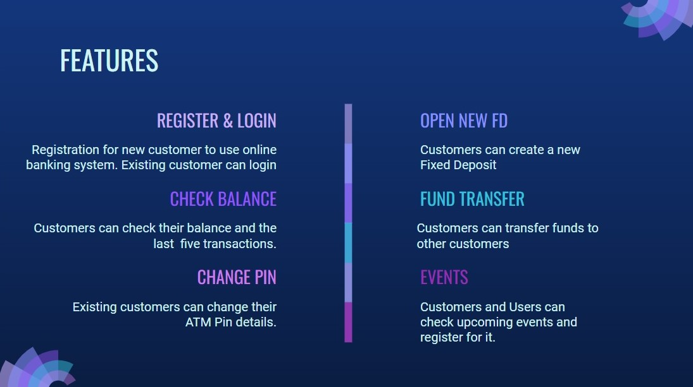

<h1 align="center">
	Online Banking Management
</h1>

  <a href="#-about-the-project">About the project</a>&nbsp;&nbsp;&nbsp;|&nbsp;&nbsp;&nbsp;
  <a href="#-features">Features</a>&nbsp;&nbsp;&nbsp;|&nbsp;&nbsp;&nbsp;
  <a href="#-built-with">Built with</a>&nbsp;&nbsp;&nbsp;|&nbsp;&nbsp;&nbsp;
  <a href="#developers">Developers</a>&nbsp;&nbsp;&nbsp;|&nbsp;&nbsp;&nbsp;

## 👨🏻‍💻 About The Project
The Online Banking Application is a Browser based Application to keep track of Account details, Fund Transfer, Transaction details and other events. 

## 🌟 Features

## 🚀 Built With

1. React
2. MySQL
3. Spring Boot

## Developers

- [Aditya Abhang](https://github.com/Adi190920)
- [Amruth Chandra](https://github.com/amruthchandra)
- [Anushri Eswaran](https://github.com/Anushri1206)
- [Aiswarya S](https://github.com/aishsanal)
- [Supriya Mallidi](https://github.com/supriyamallidi)
- [Venkat Sai] 